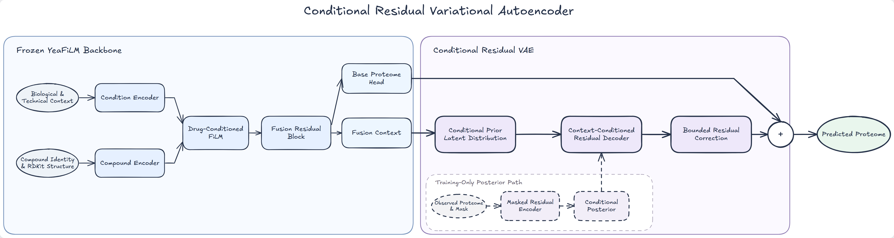

# Conditional Residual VAE：模型原理与实现说明

## 1. 模型定位

该模型对应实验 **B16-A2 Conditional Residual VAE**。它不是从零开始预测整条蛋白组的独立 VAE，而是一个建立在冻结 YeaFiLM 基础模型之上的条件残差生成模型：

1. 冻结的 YeaFiLM 根据生物学上下文、技术字段、化合物身份和 RDKit 结构生成基础蛋白组预测；
2. Conditional Residual VAE 只学习基础预测仍未解释的残差；
3. 最终预测等于基础预测与有界残差修正之和。

因此，该方法更准确的名称是 **frozen-backbone conditional residual VAE adapter**。B16-A2 阶段并非整网端到端联合微调：YeaFiLM 参数被冻结，只有 VAE 残差分支更新。

## 2. 数据边界

正式实验使用 5,920 个训练划分样本，其中去除 QC 后有 5,829 个拟合样本。蛋白过滤、缺失处理、基础均值、类别词表和 RDKit 描述符标准化统计均只由训练数据产生。最终输出轴包含 4,422 个蛋白。

验证集只用于早停、模型选择以及冻结预测后的六模块评分，不参与梯度更新，也不用于估计预处理统计量。推理阶段不读取目标样本的蛋白真值；训练期后验网络所需的观测蛋白组不会出现在验证或测试推理中。

## 3. 冻结的 YeaFiLM 主干

### 3.1 条件输入

条件分支接收除化合物身份之外的 metadata，包括菌株、培养基、温度、扰动时间以及经审计后允许使用的技术字段。化合物分支接收训练化合物 one-hot 身份、Morgan fingerprint、RDKit 分子描述符、结构可用标志和身份是否在训练中出现的标志。

对未见化合物，身份 one-hot 为全零，但只要结构可用，结构表示仍可进入模型。

### 3.2 FiLM 条件交互

条件编码器和化合物编码器分别产生条件表示与药物表示。药物表示生成 FiLM 的缩放和平移参数，对条件表示进行调制：

\[
\widetilde{c}=\bigl(1+\gamma(d)\bigr)\odot c+\beta(d),
\]

其中 \(c\) 为条件表示，\(d\) 为化合物表示。原始条件表示、化合物表示和调制后的条件表示随后进入融合残差块，得到融合上下文 \(h\)。

基础蛋白组头根据 \(h\) 生成：

\[
\widehat{y}_{\mathrm{base}}=f_{\mathrm{YeaFiLM}}(x).
\]

在 B16-A2 训练中，YeaFiLM 的 2,007,366 个参数保持冻结。模型同时提取其融合上下文 \(h\)，供 VAE 分支条件化使用。

## 4. Conditional Residual VAE

### 4.1 学习目标

VAE 不直接重建完整蛋白组，而是学习训练真值相对基础预测的残差：

\[
r=(y-\widehat{y}_{\mathrm{base}})\odot m,
\]

其中 \(m\) 是观测掩码。未观测蛋白不会参与残差编码或损失计算。

### 4.2 训练期后验

训练时，Masked Residual Encoder 将残差向量编码成紧凑表示。该表示、融合上下文以及样本的蛋白观测比例共同构成后验网络输入：

\[
q_\phi(z\mid h,r,m)=\mathcal{N}\!\left(\mu_q,\operatorname{diag}(\sigma_q^2)\right).
\]

后验分支只能在训练时使用，因为它依赖真实蛋白组产生的残差。潜变量通过重参数化采样：

\[
z_q=\mu_q+\exp\!\left(\tfrac12\log\sigma_q^2\right)\odot\epsilon,
\qquad \epsilon\sim\mathcal{N}(0,I).
\]

### 4.3 条件先验

部署时只能依据输入条件预测，因此模型另行学习条件先验：

\[
p_\theta(z\mid h)=\mathcal{N}\!\left(\mu_p,\operatorname{diag}(\sigma_p^2)\right).
\]

KL 项使训练期后验靠近仅依赖上下文的条件先验。验证和测试时完全关闭后验，直接使用先验均值 \(z=\mu_p\)，从而获得确定性预测。

### 4.4 残差解码与安全边界

解码器接收 \([h,z]\)，输出原始残差修正 \(u\)。修正通过双曲正切限制：

\[
\Delta\widehat{y}=0.75\tanh(u).
\]

最终输出为：

\[
\boxed{\widehat{y}=\widehat{y}_{\mathrm{base}}+\Delta\widehat{y}}.
\]

残差输出头采用零初始化，所以训练开始时 \(\Delta\widehat{y}=0\)，完整模型严格退化为冻结 YeaFiLM。这一设计使新增模块在初始状态不会破坏已有预测。

## 5. 损失函数

总损失由四部分组成：

\[
\mathcal{L}=
\mathcal{L}_{\mathrm{post\text{-}abs}}
+0.5\mathcal{L}_{\mathrm{prior\text{-}abs}}
+0.05\mathcal{L}_{\Delta}
+\beta_t\mathcal{L}_{\mathrm{KL,free}}.
\]

### 5.1 后验绝对预测损失

使用训练期后验样本生成修正，并对观测蛋白计算 masked MSE：

\[
\mathcal{L}_{\mathrm{post\text{-}abs}}
=\frac{\sum_{i,j}m_{ij}(y_{ij}-\widehat{y}^{(q)}_{ij})^2}
{\sum_{i,j}m_{ij}}.
\]

### 5.2 先验绝对预测损失

使用条件先验均值生成可部署预测，并直接约束其绝对蛋白丰度：

\[
\mathcal{L}_{\mathrm{prior\text{-}abs}}
=\operatorname{MaskedMSE}(y,\widehat{y}^{(p)}).
\]

该项非常重要，因为真正推理使用的是先验，而不是训练期后验。

### 5.3 配对扰动差值损失

对训练集中可严格匹配对照的处理样本，计算预测扰动差值与真实扰动差值之间的 masked MSE。5,078 个处理样本中有 5,066 个具备严格训练内匹配对照，12 个无匹配样本不进入该项。

### 5.4 KL 与 free bits

后验到条件先验的逐维 KL 为：

\[
\mathrm{KL}_k=\frac12\left[
\log\sigma_{p,k}^{2}-\log\sigma_{q,k}^{2}
+\frac{\sigma_{q,k}^{2}+(\mu_{q,k}-\mu_{p,k})^2}{\sigma_{p,k}^{2}}-1
\right].
\]

实现先对每个潜变量维度做 batch 平均，再施加每维 0.02 nat 的 free-bits 下限并求和。KL 权重在前 30 个 epoch 线性升高到 0.002，以降低训练初期的后验坍塌风险。

## 6. 训练与推理流程

训练阶段：

1. 冻结 YeaFiLM，得到基础预测与融合上下文；
2. 用训练真值构造 masked residual；
3. 后验网络产生训练潜变量，先验网络产生部署潜变量；
4. 同时优化后验绝对预测、先验绝对预测、训练内配对差值和 KL；
5. 以验证集先验均值预测的 masked RMSE 选择最佳 epoch。

推理阶段：

1. 输入 metadata 与化合物结构；
2. YeaFiLM 产生基础预测与上下文；
3. 条件先验只根据上下文输出 \(\mu_p\)；
4. 解码有界残差并与基础预测相加；
5. 不调用残差编码器和后验网络，不读取目标蛋白真值，也不进行随机采样。

## 7. 正式实验配置

主要配置为：潜变量 64，残差隐藏层 96，分布网络隐藏层 128，解码器隐藏层 128，dropout 0.1，修正上限 0.75；AdamW 学习率 0.0005，weight decay 0.0001，batch size 128，梯度裁剪 5.0，最大 300 epoch，early-stopping patience 40，随机种子 42。

VAE 分支新增 1,148,070 个可训练参数，低于实验预设的 1.5M 上限。

## 8. 正式结果与诊断

正式实验目录为 `experiments/20260816-2017_b16-a2-conditional-residual-vae-seed42/`。最佳 epoch 为 1，训练在第 41 个 epoch 因早停结束；验证 masked RMSE 为 0.434802，六模块加权总分为 49.792239。

六个标准化模块得分依次为：M1 0.981002、M2 0.396079、M3 0.219468、M4 0.329426、M5 0.695442、M6 0.467584。

残差修正的平均绝对值为 0.02037、最大绝对值为 0.21554，没有触及饱和边界。64 个潜变量均被判定为 active unit，后验坍塌标志为 false。因此模型确实学习了非平凡潜变量，而不是把 VAE 分支完全忽略。

但最佳 epoch 极早，且相对 E7 的总分提升只有约 0.1064。该结果说明：残差生成范式存在微弱有效信号，但当前数据量下，大部分可泛化信息仍由 YeaFiLM 主干承担；VAE 继续训练后更容易拟合训练残差，而不是提升验证集上的条件先验预测。后验与先验之间仍存在明显差距，也是进一步优化时最重要的问题。

## 9. 一句话总结

Conditional Residual VAE 的核心不是“用 VAE 直接生成 4,422 个蛋白”，而是让一个训练期有真值教师、推理期仅依赖条件先验的轻量生成分支，在冻结 YeaFiLM 的可靠预测上学习受限、可部署的蛋白组残差修正。
